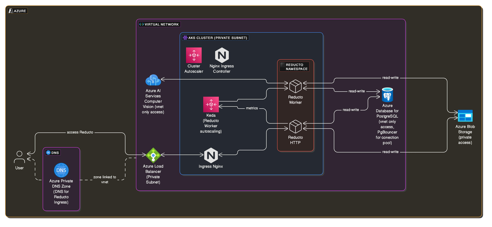

# Reducto

Install Reducto on Azure Kubernetes Service using Terraform.



## Overview

The project creates [Helm Release](./reducto-helm-release.tf) for Reducto on AKS in `reducto` namespace. And creates following required dependencies:
1. [Azure Database for PostgreSQL flexible server](./reducto-postgres.tf) with PgBouncer for connection pooling
2. [Azure Blob Storage](./reducto-storage.tf)
3. [Azure AI Service | ComputerVision](./reducto-computervision.tf)
4. AKS supported in-cluster Keda for autoscaling of in-cluster Reducto workers
5. AKS supported cluster autoscaler for Reducto node pool autoscaling
6. AKS supported nginx ingress controller for Reducto Ingress
7. Private DNS Zone for assigning DNS to Nginx Load Balancer / Reducto Ingress

This project demonstrates fully working cluster that's required to run Reducto.

## Azure Quotas

Reducto utilizes compute optimized instances, for autoscaling to work ensure that [Compute Quota on Azure Portal](https://portal.azure.com/#view/Microsoft_Azure_Capacity/QuotaMenuBlade/~/overview) in your desired region has appropriate capacity:

1. Quota for choosen `var.reducto_node_pool_vm_size` family of vCPUs
2. Quota for Total Regional vCPUs


## Helm Chart

To obtain or inspect Helm Chart and available configurations in `values.yaml`

```
# Login
helm registry login registry.reducto.ai \
    --username <your-username>  \
    --password <your-password>

# Get latest Helm Chart
helm pull oci://registry.reducto.ai/reducto-api/reducto
```

## Security

AKS node pool, Postgres DB, Load Balancer for ingress are all created in subnets with only private IP ranges. These subnets get [default outbound access](https://learn.microsoft.com/en-us/azure/virtual-network/ip-services/default-outbound-access).

For bootstrapping in-cluster resources, AKS is provisioned with public endpoint enabled.

Access to this public API server (before or after provisioning) can be restricted with `var.cluster_endpoint_public_access_cidrs`.


### Terraform State

Terraform plan and apply with locally managed `terraform.tfstate` state file for development & testing purposes.

For production workload setup a [remote state backend](https://developer.hashicorp.com/terraform/language/backend).

### Configuration

Update `variables.tf` with desired configuration.

Aternatively, create `terraform.tfvars` with following contents at a minimum:

```
subscription_id="todo"
reducto_helm_chart_version = "todo"
reducto_helm_repo_username = "todo"
reducto_helm_repo_password = "todo"
name = "todo"
private_dns_zone_name = "todo.onprem"
```

### Provisioning

Apply Terraform

```
terraform init
terraform plan
terraform apply
```

### DNS

FQDN in the form of `${var.reducto_api_subdomain}.${var.private_dns_zone_name}` for Reducto API can be resolved within Virtual Network. 

To get Load Balancer private IP for other custom DNS setup:

```
kubectl get ingress -n reducto -o jsonpath='{.items[0].status.loadBalanc
er.ingress[0].ip}'
```

### Access Reducto

Reducto will only be accesible to resources on Virtual Network, or other networks peering into it. 

To access Reducto locally, port forward your local 4567 to Reducto service via AKS API server:

```
kubectl port-forward service/reducto-reducto-http 4567:80 -n reducto

# Access Reducto
curl localhost:4567
```

## Notes on Destroy

Before `terraform destroy`, comment out the `prevent_destroy` in `lifecycle` block in `reducto-storage.tf` and `reducto-postgres.tf`

## Troubleshoot

Node pool does not scale up when it can exceed vCPU (regional or family) quotas.

To view status or error message of scale up or scale down activity:

```
kubectl get configmap -n kube-system cluster-autoscaler-status -o yaml
```